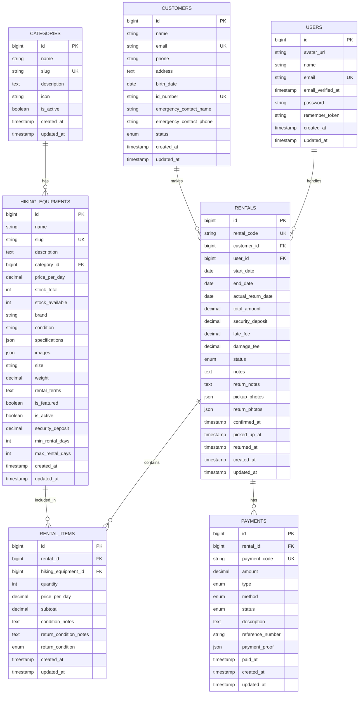

# Mountain Gear Rental - Comprehensive System Analysis

## 📋 Table of Contents
1. [System Analysis](#system-analysis)
2. [Software Requirements Specification (SRS)](#software-requirements-specification-srs)
3. [Business Requirements Document (BRD)](#business-requirements-document-brd)
4. [Entity Relationship Diagram (ERD)](#entity-relationship-diagram-erd)
5. [README](#readme)

---

## 🔍 System Analysis

### Overview
Mountain Gear Rental adalah sistem manajemen penyewaan peralatan hiking berbasis web yang dibangun menggunakan Laravel 12, Filament Admin Panel, dan RESTful API dengan dokumentasi L5 Swagger. Sistem ini dirancang untuk mengelola inventori peralatan hiking, transaksi penyewaan, data pelanggan, dan pembayaran.

### Technical Architecture

#### 🏗️ Technology Stack
- **Backend Framework**: Laravel 12 (PHP 8.2+)
- **Admin Panel**: Filament v3.3
- **Database**: MariaDB 10.11
- **Web Server**: Nginx with SSL
- **Container**: Docker & Docker Compose
- **API Documentation**: L5 Swagger (OpenAPI 3.0)
- **Frontend**: Tailwind CSS, Livewire, Alpine.js
- **Authentication**: Laravel Sanctum + Spatie Roles & Permissions

#### 🐳 Infrastructure
```yaml
Services:
├── pemweb_nginx (Nginx + SSL)
├── pemweb (PHP-FPM Laravel App)
└── db (MariaDB 10.11)
```

#### 📁 Project Structure
```
template_uas_pemweb/
├── docker-compose.yml
├── nginx/ (Web server configuration)
├── php/ (PHP-FPM configuration)
├── db/ (Database configuration & data)
└── src/ (Laravel application)
    ├── app/
    │   ├── Filament/Admin/Resources/ (Admin panel resources)
    │   ├── Http/Controllers/Api/ (API controllers)
    │   ├── Models/ (Eloquent models)
    │   ├── OpenApi/ (API documentation schemas)
    │   ├── Policies/ (Authorization policies)
    │   └── Providers/ (Service providers)
    ├── database/
    │   ├── migrations/ (Database schema)
    │   └── seeders/ (Sample data)
    ├── routes/
    │   ├── api.php (API routes)
    │   └── web.php (Web routes)
    └── config/ (Laravel configuration)
```

### 🗄️ Database Schema Analysis

#### Core Entities
1. **Categories** - Kategori peralatan hiking
2. **HikingEquipments** - Inventori peralatan
3. **Customers** - Data pelanggan
4. **Rentals** - Transaksi penyewaan
5. **RentalItems** - Detail item dalam penyewaan
6. **Payments** - Pembayaran dan transaksi keuangan
7. **Users** - Pengguna sistem (admin/staff)

#### Key Relationships
- Category → HikingEquipment (1:N)
- Customer → Rental (1:N)
- User → Rental (1:N) [Staff handler]
- Rental → RentalItem (1:N)
- HikingEquipment → RentalItem (1:N)
- Rental → Payment (1:N)

### 🚀 System Features

#### Admin Panel (Filament)
- **Dashboard**: Overview statistik dan metrics
- **User Management**: CRUD users dengan role-based access
- **Equipment Management**: Kelola inventori peralatan
- **Customer Management**: Database pelanggan
- **Rental Management**: Proses transaksi penyewaan
- **Payment Tracking**: Monitor pembayaran
- **Activity Logging**: Audit trail sistem

#### RESTful API
- **Equipment API**: CRUD peralatan dengan filtering
- **Rental API**: Manajemen penyewaan dan status
- **Authentication**: API Key-based security
- **Documentation**: Interactive Swagger UI

#### Security Features
- **Authentication**: Session-based + API Key
- **Authorization**: Role & permission-based access control
- **Data Protection**: Encrypted passwords, HTTPS
- **API Security**: Rate limiting, input validation

---

## 📑 Software Requirements Specification (SRS)

### 1. Introduction

#### 1.1 Purpose
Dokumen ini menjelaskan requirements untuk Mountain Gear Rental System, sebuah aplikasi web untuk mengelola penyewaan peralatan hiking.

#### 1.2 Scope
Sistem mencakup manajemen inventori, transaksi penyewaan, pembayaran, dan administrasi pelanggan dengan interface admin dan API endpoints.

#### 1.3 Definitions
- **Equipment**: Peralatan hiking yang tersedia untuk disewa
- **Rental**: Transaksi penyewaan peralatan
- **Customer**: Pelanggan yang menyewa peralatan
- **Admin**: Pengguna dengan akses penuh sistem
- **Staff**: Pengguna dengan akses terbatas

### 2. Overall Description

#### 2.1 Product Perspective
Sistem standalone berbasis web dengan arsitektur client-server menggunakan Laravel framework.

#### 2.2 Product Functions
- Manajemen inventori peralatan hiking
- Proses penyewaan dan pengembalian
- Tracking pembayaran dan deposit
- Laporan dan analytics
- API untuk integrasi eksternal

#### 2.3 User Classes
1. **Super Admin**: Akses penuh sistem
2. **Staff**: Operasional harian
3. **API Consumer**: Aplikasi eksternal via API

### 3. Functional Requirements

#### 3.1 Equipment Management
- **FR-01**: Sistem harus dapat menambah, mengubah, dan menghapus peralatan
- **FR-02**: Sistem harus dapat mengkategorikan peralatan
- **FR-03**: Sistem harus dapat melacak stok tersedia dan total
- **FR-04**: Sistem harus dapat mengelola spesifikasi detail peralatan

#### 3.2 Customer Management
- **FR-05**: Sistem harus dapat mendaftarkan pelanggan baru
- **FR-06**: Sistem harus dapat memvalidasi identitas pelanggan
- **FR-07**: Sistem harus dapat menyimpan data kontak darurat

#### 3.3 Rental Management
- **FR-08**: Sistem harus dapat membuat transaksi penyewaan
- **FR-09**: Sistem harus dapat menghitung biaya otomatis
- **FR-10**: Sistem harus dapat melacak status penyewaan
- **FR-11**: Sistem harus dapat mengelola pengembalian

#### 3.4 Payment Management
- **FR-12**: Sistem harus dapat mencatat pembayaran
- **FR-13**: Sistem harus dapat menghitung denda keterlambatan
- **FR-14**: Sistem harus dapat mengelola deposit keamanan

#### 3.5 API Requirements
- **FR-15**: Sistem harus menyediakan RESTful API
- **FR-16**: API harus memiliki dokumentasi interaktif
- **FR-17**: API harus menggunakan autentikasi API Key

### 4. Non-Functional Requirements

#### 4.1 Performance
- **NFR-01**: Response time API < 500ms
- **NFR-02**: Support concurrent users up to 100
- **NFR-03**: Database query optimization

#### 4.2 Security
- **NFR-04**: HTTPS untuk semua komunikasi
- **NFR-05**: Password hashing dengan bcrypt
- **NFR-06**: Role-based access control
- **NFR-07**: API rate limiting

#### 4.3 Usability
- **NFR-08**: Responsive design untuk mobile
- **NFR-09**: Intuitive admin interface
- **NFR-10**: Multi-language support ready

#### 4.4 Reliability
- **NFR-11**: 99% uptime availability
- **NFR-12**: Database backup strategy
- **NFR-13**: Error logging dan monitoring

### 5. System Requirements

#### 5.1 Hardware Requirements
- **Server**: Minimum 2 CPU cores, 4GB RAM
- **Storage**: 50GB SSD minimum
- **Network**: 100Mbps bandwidth

#### 5.2 Software Requirements
- **OS**: Linux (Ubuntu 20.04+ recommended)
- **Runtime**: PHP 8.2+, Node.js 18+
- **Database**: MariaDB 10.11+
- **Web Server**: Nginx 1.20+

---

## 💼 Business Requirements Document (BRD)

### 1. Executive Summary

Mountain Gear Rental System adalah solusi digital untuk mengotomatisasi proses bisnis penyewaan peralatan hiking. Sistem ini meningkatkan efisiensi operasional, mengurangi kesalahan manual, dan memberikan insight bisnis melalui reporting.

### 2. Business Objectives

#### 2.1 Primary Objectives
- **Efisiensi Operasional**: Mengurangi waktu proses penyewaan 70%
- **Akurasi Data**: Eliminasi kesalahan pencatatan manual
- **Customer Experience**: Proses penyewaan yang lebih cepat dan transparan
- **Inventory Control**: Real-time tracking ketersediaan peralatan

#### 2.2 Secondary Objectives
- **Scalability**: Support pertumbuhan bisnis 300%
- **Reporting**: Analytics untuk pengambilan keputusan
- **Integration**: API untuk ekspansi ke platform lain

### 3. Business Processes

#### 3.1 Current vs Future State

**Current State (Manual)**:
1. Pelanggan datang ke toko
2. Staff cek ketersediaan manual
3. Pencatatan di buku/Excel
4. Kalkulasi harga manual
5. Pembayaran tunai
6. Tracking pengembalian manual

**Future State (Digital)**:
1. Pre-booking via API/website
2. Real-time inventory check
3. Automated pricing calculation
4. Digital payment options
5. SMS/email notifications
6. Automated late fee calculation

#### 3.2 Key Performance Indicators (KPIs)
- **Operational Efficiency**: Waktu proses penyewaan
- **Customer Satisfaction**: Rating kepuasan pelanggan
- **Inventory Turnover**: Tingkat utilisasi peralatan
- **Revenue Growth**: Peningkatan pendapatan
- **Error Rate**: Persentase kesalahan proses

### 4. Stakeholder Analysis

#### 4.1 Primary Stakeholders
- **Business Owner**: ROI, profit margin, growth
- **Store Manager**: Daily operations, staff productivity
- **Staff**: Ease of use, reduced workload
- **Customers**: Fast service, transparent pricing

#### 4.2 Secondary Stakeholders
- **IT Support**: System maintenance, updates
- **Accountant**: Financial reporting, audit trail
- **Marketing**: Customer data, campaign insights

### 5. Business Rules

#### 5.1 Rental Rules
- Minimum rental period: 1 day
- Maximum rental period: 30 days
- Security deposit: 50% of equipment value
- Late fee: 10% per day after due date
- Damage assessment: Staff evaluation required

#### 5.2 Payment Rules
- Payment methods: Cash, Transfer, E-wallet
- Deposit required before equipment release
- Refund process: 3-7 business days
- Cancellation: 24 hours before start date

#### 5.3 Inventory Rules
- Stock alert: When available < 10% of total
- Equipment maintenance: Every 50 rental cycles
- Retirement criteria: Age > 5 years or damage

### 6. Risk Analysis

#### 6.1 Technical Risks
- **System Downtime**: Backup systems dan maintenance schedule
- **Data Loss**: Regular backup dan disaster recovery
- **Security Breach**: Multi-layer security measures

#### 6.2 Business Risks
- **Staff Adoption**: Training program dan change management
- **Customer Adaptation**: Gradual rollout dan support
- **Competition**: Continuous feature enhancement

### 7. Success Criteria

#### 7.1 Immediate (3 months)
- 100% staff adoption
- 50% reduction in processing time
- Zero critical system bugs

#### 7.2 Short-term (6 months)
- 25% increase in rental volume
- 90% customer satisfaction
- Full ROI achievement

#### 7.3 Long-term (12 months)
- 200% business growth capacity
- Advanced analytics implementation
- Multi-branch support ready

---

## 📊 Entity Relationship Diagram (ERD)

### Database Schema Overview



### Detailed Entity Descriptions

#### 1. Categories
**Purpose**: Kategorisasi peralatan hiking (Tenda, Tas, Sepatu, dll)
- Primary Key: `id`
- Unique Key: `slug`
- Relationships: One-to-Many dengan HikingEquipments

#### 2. HikingEquipments
**Purpose**: Master data peralatan yang tersedia untuk disewa
- Primary Key: `id`
- Foreign Key: `category_id` → Categories
- Unique Key: `slug`
- Key Fields: `stock_total`, `stock_available`, `price_per_day`

#### 3. Customers
**Purpose**: Database pelanggan dengan informasi kontak dan identitas
- Primary Key: `id`
- Unique Keys: `email`, `id_number`
- Business Rule: Validasi KTP/SIM wajib

#### 4. Users
**Purpose**: Pengguna sistem (admin/staff) dengan role-based access
- Primary Key: `id`
- Unique Key: `email`
- Integration: Spatie Roles & Permissions

#### 5. Rentals
**Purpose**: Transaksi penyewaan dengan tracking status lengkap
- Primary Key: `id`
- Foreign Keys: `customer_id`, `user_id`
- Unique Key: `rental_code`
- Status Flow: pending → confirmed → active → returned/overdue

#### 6. RentalItems
**Purpose**: Detail item dalam setiap transaksi penyewaan
- Primary Key: `id`
- Foreign Keys: `rental_id`, `hiking_equipment_id`
- Composite Business Key: (rental_id, hiking_equipment_id)

#### 7. Payments
**Purpose**: Tracking pembayaran dan transaksi keuangan
- Primary Key: `id`
- Foreign Key: `rental_id`
- Unique Key: `payment_code`
- Types: rental, deposit, late_fee, damage_fee, refund

### Database Indexes

```sql
-- Performance Indexes
CREATE INDEX idx_hiking_equipments_category ON hiking_equipments(category_id);
CREATE INDEX idx_hiking_equipments_active ON hiking_equipments(is_active, stock_available);
CREATE INDEX idx_rentals_status ON rentals(status);
CREATE INDEX idx_rentals_dates ON rentals(start_date, end_date);
CREATE INDEX idx_payments_status ON payments(status, type);

-- Composite Indexes
CREATE INDEX idx_rental_items_lookup ON rental_items(rental_id, hiking_equipment_id);
CREATE INDEX idx_rentals_customer_status ON rentals(customer_id, status);
```

---

## 📖 README

# 🏔️ Mountain Gear Rental System

> **Sistem Manajemen Penyewaan Peralatan Hiking** berbasis Laravel dengan Filament Admin Panel dan RESTful API

[](https://laravel.com)
[](https://php.net)
[](https://filamentphp.com)
[](LICENSE)

## 🚀 Features

### 🎛️ Admin Panel (Filament)
- **Dashboard**: Real-time statistics dan metrics
- **Equipment Management**: CRUD inventori dengan kategori
- **Customer Database**: Manajemen data pelanggan
- **Rental Processing**: Workflow penyewaan end-to-end
- **Payment Tracking**: Monitor pembayaran dan deposit
- **User Management**: Role-based access control
- **Activity Logging**: Audit trail lengkap
- **Responsive Design**: Mobile-friendly interface

### 🔌 RESTful API
- **Equipment API**: CRUD dengan filtering dan search
- **Rental API**: Manajemen penyewaan dan status tracking
- **Interactive Documentation**: Swagger UI di `/documentation`
- **API Key Authentication**: Secure access control
- **Rate Limiting**: DoS protection
- **Error Handling**: Standardized error responses

### 🔐 Security Features
- **Authentication**: Session + API Key dual layer
- **Authorization**: Spatie Roles & Permissions
- **Data Protection**: Encrypted storage, HTTPS
- **Input Validation**: Comprehensive request validation
- **CSRF Protection**: Laravel's built-in security

## 🏗️ Tech Stack

| Component | Technology | Version |
|-----------|------------|---------|
| **Backend** | Laravel | 12.0+ |
| **Admin Panel** | Filament | 3.3+ |
| **Database** | MariaDB | 10.11+ |
| **Web Server** | Nginx | 1.20+ |
| **PHP Runtime** | PHP-FPM | 8.2+ |
| **Containerization** | Docker | Latest |
| **Frontend** | Tailwind CSS + Livewire | Latest |
| **API Docs** | L5 Swagger | 9.0+ |

## 🐳 Quick Start with Docker

### Prerequisites
- Docker & Docker Compose
- Git
- Ports 80, 443, 23306 available

### Installation

1. **Clone Repository**
```bash
git clone <repository-url>
cd template_uas_pemweb
```

2. **Environment Setup**
```bash
cd src
cp .env.example .env
# Edit database credentials in .env
```

3. **Start Services**
```bash
docker-compose up -d
```

4. **Install Dependencies**
```bash
# Enter PHP container
docker exec -it pemweb bash

# Install PHP dependencies
composer install

# Generate application key
php artisan key:generate

# Run migrations
php artisan migrate --seed

# Install Filament Shield
php artisan shield:install --fresh

# Generate API documentation
php artisan l5-swagger:generate
```

5. **Create Admin User**
```bash
php artisan make:user
# Follow prompts to create admin user
```

### 🌐 Access Points

| Service | URL | Credentials |
|---------|-----|-------------|
| **Main Application** | https://pemweb.uas | - |
| **Admin Panel** | https://pemweb.uas/admin | Created admin user |
| **API Documentation** | https://pemweb.uas/documentation | API Key required |
| **Database** | localhost:23306 | root/p455w0rd |

## 📡 API Usage

### Authentication
All API endpoints require API Key authentication:
```bash
curl -H "X-API-KEY: your-api-key" https://pemweb.uas/api/hiking-equipment
```

### Equipment Endpoints
```bash
# List all equipment
GET /api/hiking-equipment

# Get specific equipment
GET /api/hiking-equipment/{id}

# Create equipment
POST /api/hiking-equipment

# Update equipment
PUT /api/hiking-equipment/{id}

# Delete equipment
DELETE /api/hiking-equipment/{id}
```

### Rental Endpoints
```bash
# List rentals
GET /api/rentals?status=active

# Create rental
POST /api/rentals

# Get rental details
GET /api/rentals/{id}

# Update rental status
PUT /api/rentals/{id}/status
```

## 🗄️ Database Schema

### Core Tables
```sql
categories          # Equipment categories
hiking_equipments   # Equipment inventory
customers          # Customer database
rentals           # Rental transactions
rental_items      # Rental line items
payments          # Payment records
users             # System users
```

### Key Relationships
- Category → Equipment (1:N)
- Customer → Rental (1:N)
- Rental → RentalItem (1:N)
- Equipment → RentalItem (1:N)
- Rental → Payment (1:N)

## 🔧 Configuration

### Environment Variables
```env
# Application
APP_NAME="Mountain Gear Rental"
APP_URL=https://pemweb.uas

# Database
DB_CONNECTION=mariadb
DB_HOST=db
DB_DATABASE=djambred
DB_USERNAME=root
DB_PASSWORD=p455w0rd

# API Security
API_KEY=your-secret-api-key
```

### Nginx SSL Configuration
SSL certificates included for `pemweb.uas` domain. For production:
1. Replace certificates in `nginx/ssl/`
2. Update domain in `nginx/default.conf`
3. Update `APP_URL` in `.env`

## 🚀 Deployment

### Production Checklist
- [ ] Update `.env` with production values
- [ ] Set `APP_ENV=production`
- [ ] Configure SSL certificates
- [ ] Set up database backups
- [ ] Configure log rotation
- [ ] Set up monitoring
- [ ] Test API key security
- [ ] Verify email configuration

### Performance Optimization
```bash
# Laravel optimizations
php artisan config:cache
php artisan route:cache
php artisan view:cache
php artisan queue:work

# Database optimization
php artisan db:show
php artisan migrate:status
```

## 📊 Monitoring & Maintenance

### Health Checks
```bash
# Application health
curl https://pemweb.uas/up

# Database connection
php artisan tinker
>>> DB::connection()->getPdo()

# Queue status
php artisan queue:monitor
```

### Backup Strategy
```bash
# Database backup
mysqldump -h localhost -P 23306 -u root -pp455w0rd djambred > backup.sql

# File backup
tar -czf files-backup.tar.gz src/storage/app
```

## 🤝 Contributing

1. Fork the repository
2. Create feature branch (`git checkout -b feature/amazing-feature`)
3. Commit changes (`git commit -m 'Add amazing feature'`)
4. Push to branch (`git push origin feature/amazing-feature`)
5. Open Pull Request

### Development Guidelines
- Follow PSR-12 coding standards
- Write comprehensive tests
- Update API documentation
- Add database migrations for schema changes

## 📝 License

This project is licensed under the MIT License - see the [LICENSE](LICENSE) file for details.

## 🆘 Support

### Documentation
- [Laravel Documentation](https://laravel.com/docs)
- [Filament Documentation](https://filamentphp.com/docs)
- [API Documentation](https://pemweb.uas/documentation)

### Troubleshooting

**Common Issues:**

1. **Port 80/443 already in use**
```bash
sudo lsof -i :80
sudo lsof -i :443
# Kill conflicting processes
```

2. **Database connection failed**
```bash
# Check database container
docker logs db
# Verify credentials in .env
```

3. **API Key not working**
```bash
# Check middleware configuration
# Verify X-API-KEY header format
```

4. **Permission errors**
```bash
# Fix Laravel permissions
sudo chown -R www-data:www-data src/storage
sudo chmod -R 775 src/storage
```

### Performance Monitoring
- **Application**: Laravel Telescope (optional)
- **Database**: phpMyAdmin at database:3306
- **Logs**: `src/storage/logs/laravel.log`
- **API Metrics**: Swagger UI analytics

---

## 📞 Contact

**Project Maintainer**: Mountain Gear Support  
**Email**: support@mountaingear.com  
**Documentation**: https://pemweb.uas/documentation  
**Repository**: [GitHub Repository URL]

---

*Built with ❤️ for outdoor enthusiasts*
